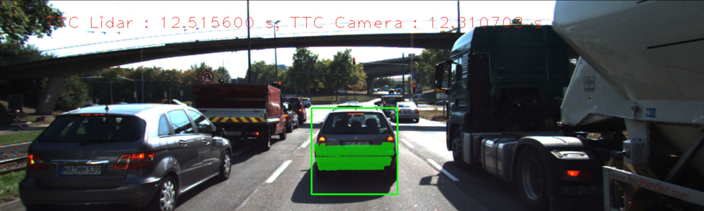
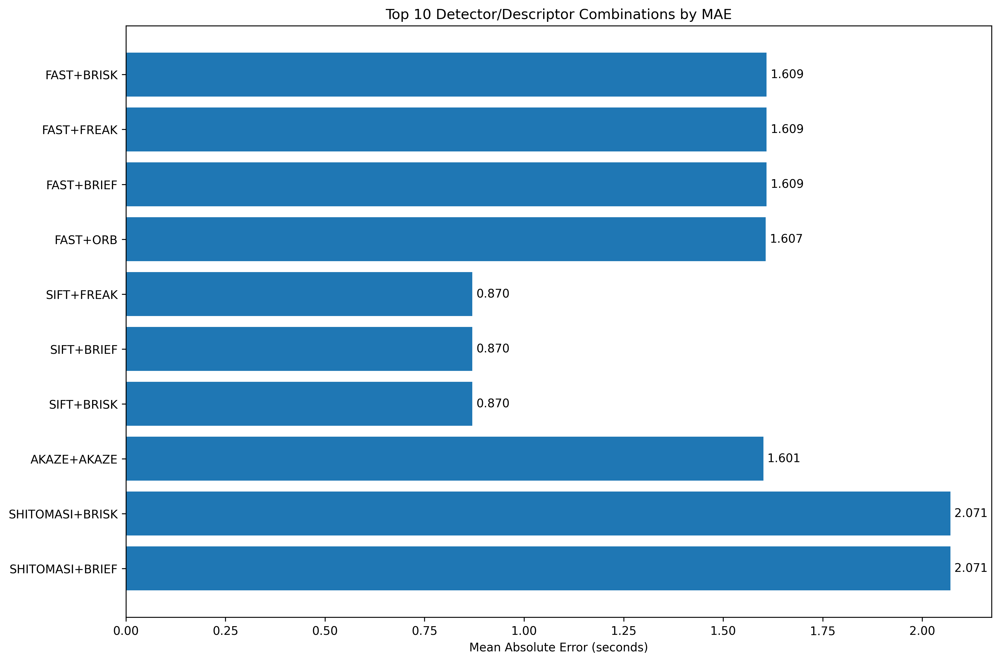
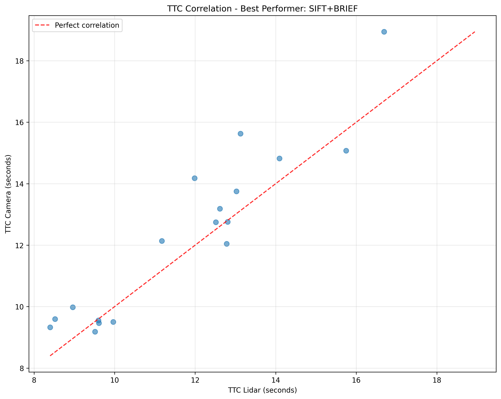
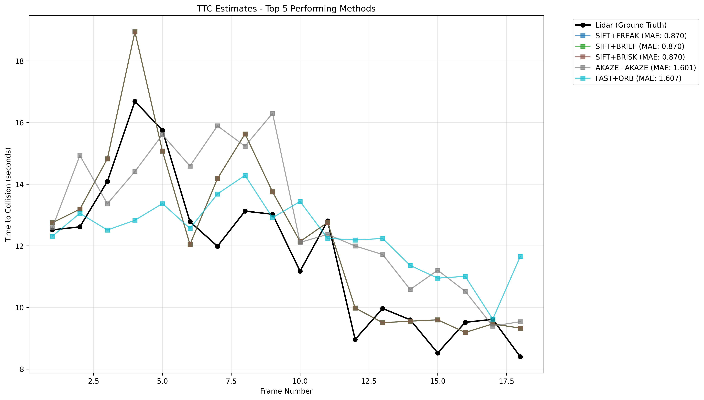
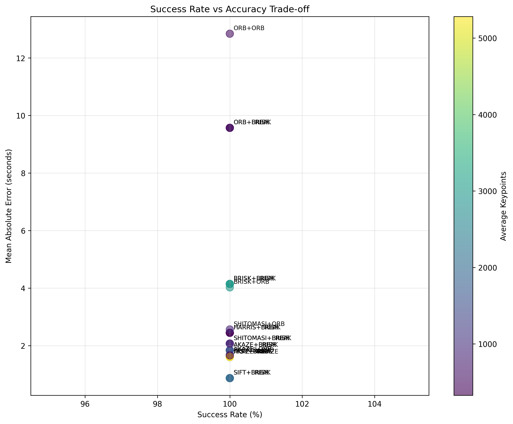

# 3D Object Tracking
*Part 2 of Building Collision Detection Systems*


## 1. Overview
In our previous exercise, [2D Object Tracking](https://github.com/moorissa/2D-object-tracking), we gained a solid understanding of keypoint detectors, descriptors, and methods to match them between successive images. We also learned how to detect objects in an image using the YOLO deep-learning framework. And finally, you know how to associate regions in a camera image with Lidar points in 3D space. Let's take a look at our program schematic to see what we already have accomplished and what's still missing.


In this continuance of the 2D project, we will now implement the missing parts in the schematic. To do this, we will complete four major tasks: 
1. Develop a way to match 3D objects over time by using keypoint correspondences. 
2. Compute the TTC based on Lidar measurements. 
3. Proceed to do the same using the camera, which requires to first associate keypoint matches to regions of interest and then to compute the TTC based on those matches. 
4. Lastly, conduct various tests with the framework. 

The final goal is to identify the most suitable detector/descriptor combination for TTC estimation and also to search for problems that can lead to faulty measurements by the camera or Lidar sensor. In the last course of this Nanodegree, we will learn about the Kalman filter, which is a great way to combine the two independent TTC measurements into an improved version which is much more reliable than a single sensor alone can be. But before we think about such things, let us focus on your final project in the camera course. 


## 2. Table of Contents
- [Project Instructions](#build)
- [Implementation](#implementation)
- [Evaluation](#eval)
- [Acknowledgements](#acknowledgements)


## 3. Project Instructions <a name="build"></a>
The main program can be built and ran by doing the following from the project top directory.

1. Clone this repo with LFS, which can be done in two ways:
  1. `git lfs clone https://github.com/moorissa/3D-object-tracking` OR
  2. Alternatively:
  ```bash
    git clone https://github.com/moorissa/3D-object-tracking
    cd 3D-object-tracking  # ensure no duplicated names in the same directory
    git lfs pull
  ```
  If LFS continues causing (submission) issues:
   - Upload PCD files to a cloud service (Google Drive, Dropbox) and include download links
   - Use smaller sample PCD files that don't require LFS
   - Compress the PCD files if possible
2. Make a build directory: `mkdir build && cd build`
3. Compile: `cmake .. && make -j`
4. Run it: `./3D_object_tracking`

In short, we can rerun it with: `rm -rf ./* && cmake .. && make && ./ukf_highway`

#### Dependencies
* cmake >= 3.10
  * All OSes: [click here for installation instructions](https://cmake.org/install/)
* make >= 3.8
  * Linux: make is installed by default on most Linux distros
  * Mac: [install Xcode command line tools to get make](https://developer.apple.com/xcode/features/)
  * Windows: [Click here for installation instructions](http://gnuwin32.sourceforge.net/packages/make.htm)
* gcc/g++ >= 5.4
  * Linux: gcc / g++ is installed by default on most Linux distros
  * Mac: same deal as make - [install Xcode command line tools](https://developer.apple.com/xcode/features/)
  * Windows: recommend using [MinGW](http://www.mingw.org/)
* OpenCV >= 4.1
  * [Documentation](https://opencv.org/)

#### Currently used (2025 version):
* MacOS: Sequoia 15.5
* cmake: 3.31.7
* GNU make: 3.81
* gcc: 
  ```
  Target: arm64-apple-darwin24.5.0
  Thread model: posix
  InstalledDir: /Library/Developer/CommandLineTools/usr/bin
  ```
* pcl: stable 1.15.0


## 4. Implementation <a name="implementation"></a>
The design of the project is based on the schematic shown in Figure 1 above. I completed the following tasks to achieve that goal.

### 4.0. Match 2D objects
File(s): [matching2D_Student.cpp](./src/matching2D_Student.cpp)

Reusing 2D feature tracking code to detect keypoints, extract and match descriptors. Various type of detectors are implemented, including `detKeypointsShiTomasi`, `detKeypointsHarris`, and `detKeypointsModern`.

### 4.1. Match 3D Objects
File(s): [camFusion_Student.cpp](./src/camFusion_Student.cpp)

Implementing `matchBoundingBoxes()` method - only bounding boxes containing matched keypoints will be considered, i.e. within the ROI. For each bounding box in the previous frame, only one best match in the current frame is extracted. The final output is a hashmap of bounding box matches.

### 4.2. Compute TTC with Lidar data
File(s): [camFusion_Student.cpp](./src/camFusion_Student.cpp)

Implementing `computeTTCLidar()` method - to eliminate outliers (e.g. detections that are too close to ego vehicle), currently 20% of the total number of Lidar points is used to calculate mean closest distance to the preceding vehicle. This would be deemed more robust than simply using the closest Lidar points.

### 4.3. Associate keypiont correspondences with bounding boxes
File(s): [camFusion_Student.cpp](./src/camFusion_Student.cpp)

Implementing `clusterKptMatchesWithROI()` method - to associate keypoint correspondences with bounding boxes. All keypoint matches must belong to a 3D object, simply checking whether the corresponding keypoints are within the ROI in the camera image. To have a robust TTC estimation, outliers among the matches are removed using the mean of all euclidean distances between keypoint matches.

### 4.4. Compute TTC with camera images
File(s): [camFusion_Student.cpp](./src/camFusion_Student.cpp)

Implementing `computeTTCCamera()` method - this is the final step in the [FinalProject_Camera.cpp](./src/FinalProject_Camera.cpp) pipeline that helps generate TTC estimations based on both Lidar points and Camera images. 

#### Example output as follows.

```bash
$ ./3D_object_tracking

ORB descriptor extraction in 3.51038 ms
ORB descriptor extraction in 2.52212 ms
Frame Number : 1 TTC Lidar : 12.515600 s, TTC Camera : 12.310703 s
Press key to continue to next frame
ORB descriptor extraction in 2.45283 ms
Frame Number : 2 TTC Lidar : 12.614245 s, TTC Camera : 13.053056 s
Press key to continue to next frame
ORB descriptor extraction in 2.35621 ms
Frame Number : 3 TTC Lidar : 14.091013 s, TTC Camera : 12.510941 s
Press key to continue to next frame
ORB descriptor extraction in 2.40604 ms
Frame Number : 4 TTC Lidar : 16.689386 s, TTC Camera : 12.828827 s
Press key to continue to next frame
...
```



## 5. Evaluation <a name="eval"></a>
Here we tweak a bit the `FinalProject_Camera.cpp` to easily iterate through combinations of detectors and descriptors. Let's call the file `FinalProject_Camera_compare.cpp`. Its output can be found in [ttc_analysis_results.csv](results/ttc_analysis_results.csv), which shows camera-based TTC estimations of all combinations tested. The results are then massaged further using Python script [`2025_06_14_plots_and_analysis.ipynb`](src/2025_06_14_plots_and_analysis.ipynb)) or [this notebook link](https://colab.research.google.com/drive/1JaFzd7fTuj-zjOB3ilS6ukK-HYRJ_mMm?usp=sharing) to summarize performance of these combinations, as seen below. 

```python
===============================================================
TTC ANALYSIS SUMMARY - TOP 10 PERFORMERS
================================================================================
 Rank     Combination   MAE  RMSE  Relative_Error_%  Stability_StdDev  Success_Rate_%  Outlier_Rate_%  Avg_Keypoints  Avg_Matches
    1      FAST+BRISK 1.609 1.941            14.922             0.870           100.0           0.000       5282.333     2241.000
    2      FAST+FREAK 1.609 1.941            14.922             0.870           100.0           0.000       5282.333     2241.000
    3      FAST+BRIEF 1.609 1.941            14.922             0.870           100.0           0.000       5282.333     2241.000
    4        FAST+ORB 1.607 1.978            14.723             1.095           100.0           0.000       5282.333     2853.056
    5      SIFT+FREAK 0.870 1.130             7.353             2.696           100.0           0.000       1983.056      774.667
    6      SIFT+BRIEF 0.870 1.130             7.353             2.696           100.0           0.000       1983.056      774.667
    7      SIFT+BRISK 0.870 1.130             7.353             2.696           100.0           0.000       1983.056      774.667
    8     AKAZE+AKAZE 1.601 1.953            14.328             2.153           100.0           0.000       1548.000     1120.556
    9 SHITOMASI+BRISK 2.071 2.464            19.229             1.411           100.0           6.667        838.600      365.000
   10 SHITOMASI+BRIEF 2.071 2.464            19.229             1.411           100.0           6.667        838.600      365.000

==================================================
WORST 5 PERFORMERS
==================================================
 Rank Combination    MAE   RMSE  Relative_Error_%  Stability_StdDev  Success_Rate_%  Outlier_Rate_%  Avg_Keypoints  Avg_Matches
   24 BRISK+BRIEF  4.145  5.178            36.292             4.099           100.0          33.333       2988.389     1580.167
   25   ORB+BRISK  9.570 16.233            79.459            14.810           100.0          40.000        500.000      311.600
   26   ORB+BRIEF  9.570 16.233            79.459            14.810           100.0          40.000        500.000      311.600
   27   ORB+FREAK  9.570 16.233            79.459            14.810           100.0          40.000        500.000      311.600
   28     ORB+ORB 12.843 17.966           116.737            13.011           100.0          66.667        500.000      326.111

Best performer: FAST+BRISK (MAE: 1.609s)
Worst performer: ORB+ORB (MAE: 12.843s)
Most stable: FAST+BRIEF (StdDev: 0.870s)
Highest success rate: AKAZE+AKAZE (100.0%)
Creating visualizations...
Visualizations saved to ttc_analysis_plots/
```

It seems like some unstable results are spotted and those faulty estimations appear quite often for particular detector types, like FAST, BRISK, and ORB. Some detector types are also more prone to produce clearly wrong results, like HARRIS and ORB. Those faults could be a result of keypoint detection and matching process.

Based on the above analysis, `FAST` combinations perform the highest (with the smallest RMSE), and the winner combination is `FAST + BRISK/FREAK/BRIEF` detector/descriptor pair at MAE of 1.609, while `ORB`s give the worst performing combinations. See below for resulting plots.








## 6. Ackowledgements <a name="acknowledgements"></a>
* [Udacity Sensor Fusion Program](https://www.udacity.com/course/sensor-fusion-engineer-nanodegree--nd313)

For any questions or feedback, feel free to email [moorissa.tjokro@columbia.edu](mailto:moorissa.tjokro@columbia.edu).


