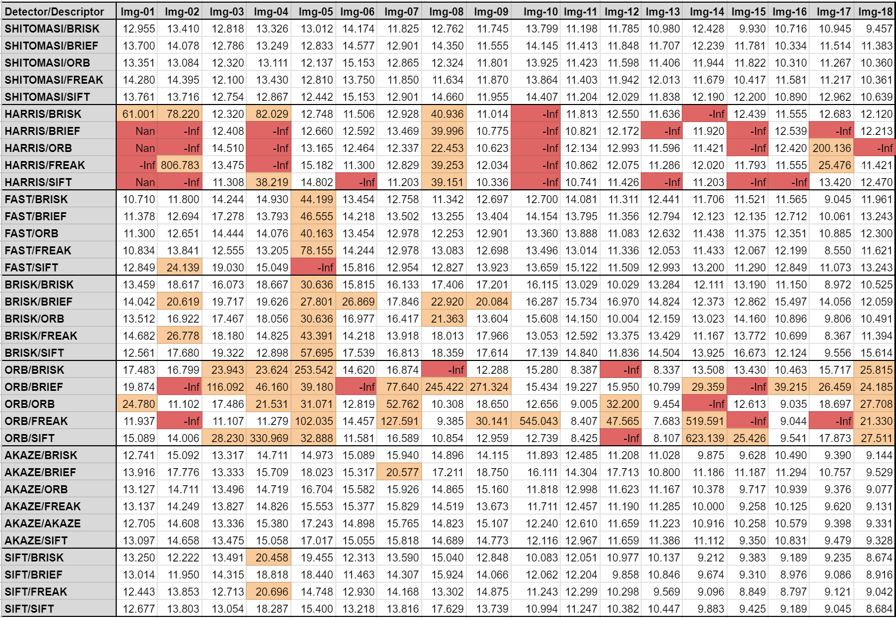
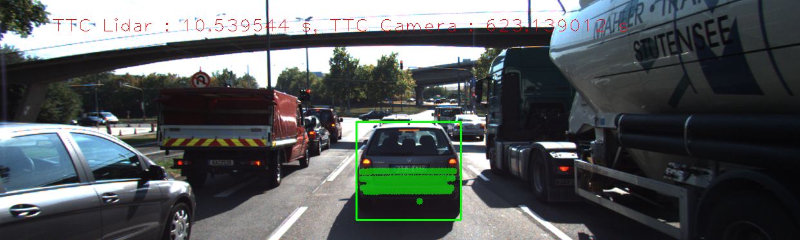
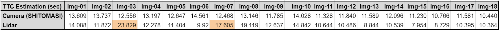

# 3D Object Tracking
*Part 2 of Building Collision Detection Systems*

## 1. Overview
In our previous exercise, [2D Object Tracking](https://github.com/moorissa/2D-object-tracking), we gained a solid understanding of keypoint detectors, descriptors, and methods to match them between successive images. We also learned how to detect objects in an image using the YOLO deep-learning framework. And finally, you know how to associate regions in a camera image with Lidar points in 3D space. Let's take a look at our program schematic to see what we already have accomplished and what's still missing.


In this continuance of the 2D project, we will now implement the missing parts in the schematic. To do this, we will complete four major tasks: 
1. Develop a way to match 3D objects over time by using keypoint correspondences. 
2. Compute the TTC based on Lidar measurements. 
3. Proceed to do the same using the camera, which requires to first associate keypoint matches to regions of interest and then to compute the TTC based on those matches. 
4. Lastly, conduct various tests with the framework. 

The final goal is to identify the most suitable detector/descriptor combination for TTC estimation and also to search for problems that can lead to faulty measurements by the camera or Lidar sensor. In the last course of this Nanodegree, we will learn about the Kalman filter, which is a great way to combine the two independent TTC measurements into an improved version which is much more reliable than a single sensor alone can be. But before we think about such things, let us focus on your final project in the camera course. 


## 2. Table of Contents
- [Project Instructions](#build)
- [Implementation](#implementation)
- [Acknowledgements](#acknowledgements)


## 3. Project Instructions <a name="build"></a>
The main program can be built and ran by doing the following from the project top directory.

1. Clone this repo with LFS, which can be done in two ways:
  1. `git lfs clone https://github.com/moorissa/3D-object-tracking` OR
  2. Alternatively:
  ```bash
    git clone https://github.com/moorissa/3D-object-tracking
    cd 3D-object-tracking  # ensure no duplicated names in the same directory
    git lfs pull
  ```
  If LFS continues causing (submission) issues:
   - Upload PCD files to a cloud service (Google Drive, Dropbox) and include download links
   - Use smaller sample PCD files that don't require LFS
   - Compress the PCD files if possible
2. Make a build directory: `mkdir build && cd build`
3. Compile: `cmake .. && make -j`
4. Run it: `./3D_object_tracking`

In short, we can rerun it with: `rm -rf ./* && cmake .. && make && ./ukf_highway`

#### Dependencies
* cmake >= 3.10
  * All OSes: [click here for installation instructions](https://cmake.org/install/)
* make >= 3.8
  * Linux: make is installed by default on most Linux distros
  * Mac: [install Xcode command line tools to get make](https://developer.apple.com/xcode/features/)
  * Windows: [Click here for installation instructions](http://gnuwin32.sourceforge.net/packages/make.htm)
* gcc/g++ >= 5.4
  * Linux: gcc / g++ is installed by default on most Linux distros
  * Mac: same deal as make - [install Xcode command line tools](https://developer.apple.com/xcode/features/)
  * Windows: recommend using [MinGW](http://www.mingw.org/)
* OpenCV >= 4.1
  * [Documentation](https://opencv.org/)

#### Currently used (2025 version):
* MacOS: Sequoia 15.5
* cmake: 3.31.7
* GNU make: 3.81
* gcc: 
  ```
  Target: arm64-apple-darwin24.5.0
  Thread model: posix
  InstalledDir: /Library/Developer/CommandLineTools/usr/bin
  ```
* pcl: stable 1.15.0


## 4. Implementation <a name="implementation"></a>
The design of the project is based on the schematic shown in Figure 1 above. I completed the following tasks to achieve that goal.

### 4.0. Match 2D objects

In the [matching2D_Student.cpp](./src/matching2D_Student.cpp), I resued the mid-term project code to detect keypoints, extract descriptors and match descriptors. Various type of detectors and descriptors are implemented. ([3f78bae](https://github.com/fanweng/Udacity-Sensor-Fusion-Nanodegree/commit/3f78baee292a87ea4974cf637077b527ecf5433c))

### 4.1. Match 3D Objects

In the [camFusion_Student.cpp](./src/camFusion_Student.cpp), I implemented `matchBoundingBoxes()` method, in which inputs are previous and the current data frames as well as matched keypoints between the two frames. Only those bounding boxes containing the matched keypoints will be considered, i.e. within the ROI. For each bounding box in the previous frame, only one best match in the current frame is extracted. The final output is a hashmap of bounding box matches. ([63d2b20](https://github.com/fanweng/Udacity-Sensor-Fusion-Nanodegree/commit/63d2b206722ef6ffc1fd612227affa1bd3999cd0))

### 4.2. Compute TTC with Lidar data

In the [camFusion_Student.cpp](./src/camFusion_Student.cpp), `computeTTCLidar()` method was implemented. To eliminate the outliers (e.g. too close to ego vehicle), I used 20% of the total number of Lidar points to calculate the averaging closest distance to the preceding vehicle. This would be more robust than simply using the closest Lidar point. ([cc31837](https://github.com/fanweng/Udacity-Sensor-Fusion-Nanodegree/commit/cc318378f5741854b1086e21d47ed6c9364b8e9b))

### 4.3. Associate keypiont correspondences with bounding boxes

In the [camFusion_Student.cpp](./src/camFusion_Student.cpp), `clusterKptMatchesWithROI()` method was developed to associate keypoint correspondences with bounding boxes. All keypoint matches must belong to a 3D object, simply checking whether the corresponding keypoints are within the ROI in the camera image. To have a robust TTC estimation, outliers among the matches are removed using the mean of all euclidean distances between keypoint matches. ([35a4741](https://github.com/fanweng/Udacity-Sensor-Fusion-Nanodegree/commit/35a4741cc62d47bf9d6497fc2a50f538ba27265b))

### 4.4. Compute TTC with camera images

In the [camFusion_Student.cpp](./src/camFusion_Student.cpp), using the knowledge learned in the [Lecture 2-2 Collision Detection Systems](../../lectures/lec2-2-collision-detection-system.md), I completed the `computeTTCCamera` method. ([5271344](https://github.com/fanweng/Udacity-Sensor-Fusion-Nanodegree/commit/5271344f13cadc9d882d56c7e23fd2d7bbc36531))

After finishing the pipeline in the [FinalProject_Camera.cpp](./src/FinalProject_Camera.cpp), I could generate TTC estimations based on both Lidar points and Camera images. An example output looks like the screenshot below.


## III. Performance and Results

And lastly, I conducted various tests with different detector/descriptor combinations using the same framework. The table below shows camera-based TTC estimations of all combinations I tested. Some unstable results (indicated in orange) are spotted and those faulty estimations appear quite often for particular detector types, like FAST, BRISK, and ORB. Some detector types are also more prone to produce clearly wrong results (indicated in red), like HARRIS and ORB. Those faults could be a result of keypoint detection and matching process.



Take the estimation results on *Img-14* as an example, particularly on two detector/descriptor combinations - *SHITOMASI/SIFT* and *ORB/SIFT* (see screenshots and execution logs below). The estimation based on *ORB/SIFT* combination is clearly a wrong value (623.139s), and it could be cause by the limited number of keypoints/matches detected. As a comparison, *SHITOMASI/SIFT* combination produces a reasonable TTC estimation (12.190s) where it detects 30% more keypionts/matches.




```bash
# ORB/SIFT outputs on Img-14
ORB detector with n=500 keypoints in 13.6058 ms
ORB detector with n=96 keypoints in the rectangle ROI
MAT_BF matching produced n=95 matches in 0.463706 ms
TTC Estimation: 623.139s

# SHITOMASI/SIFT outputs on Img-14
Shi-Tomasi detection with n=1886 keypoints in 13.5002 ms
SHITOMASI detector with n=127 keypoints in the rectangle ROI
MAT_BF matching produced n=138 matches in 1.32935 ms
TTC Estimation: 12.190s
```

Based on the above analysis, I would be more confident with the results generated by SHITOMASI detector. I averaged out the 5 SHITOMASI detector test results for 18 frames to produce the camera-based TTC estimation in the table below. Also, I compared the Lidar-based estimation with the SHITOMASI outputs frame by frame. Two Lidar results are questionable (indicated in orange) because their values are almost doubled compared to the previous frames. A more robust way of filtering out outlier Lidar points would be helpful to mitigate the faulty Lidar-based estimation.



I collected 18 frames of TTC estimation and made the following short clip for demonstration. SHITOMASI-BRISK combination was used for camera-based estimation.


## 5. Ackowledgements <a name="acknowledgements"></a>
* [Udacity Sensor Fusion Program](https://www.udacity.com/course/sensor-fusion-engineer-nanodegree--nd313)

For any questions or feedback, feel free to email [moorissa.tjokro@columbia.edu](mailto:moorissa.tjokro@columbia.edu).


